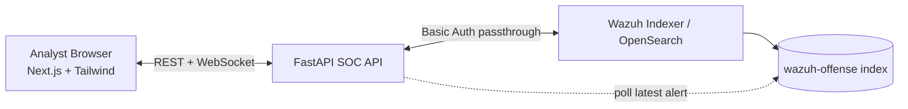

# Wazuh SOC Ticketing Architecture

## 1) System architecture diagram



## 2) Full project folder structure

```text
.
├── app/
│   ├── components/
│   │   ├── DashboardPanels.tsx
│   │   ├── InvestigationPanel.tsx
│   │   ├── KpiCards.tsx
│   │   ├── LoginForm.tsx
│   │   └── TicketsTable.tsx
│   ├── globals.css
│   ├── layout.tsx
│   └── page.tsx
├── backend/
│   ├── app/
│   │   ├── config.py
│   │   ├── indexer.py
│   │   ├── main.py
│   │   ├── models.py
│   │   ├── security.py
│   │   └── ws.py
│   ├── Dockerfile
│   └── requirements.txt
├── lib/
│   ├── api.ts
│   └── types.ts
├── docker-compose.yml
├── Dockerfile.frontend
└── docs/ARCHITECTURE.md
```

## 3) Backend FastAPI code skeleton

- Auth endpoints: `/api/auth/login`, `/api/auth/me`
- Ticket list/detail/update
- Bulk assign/status/delete
- Dashboard aggregations
- All persistence and auth delegated to Indexer only

## 4) WebSocket implementation

- Endpoint: `/ws?token=<base64(username:password)>`
- Validates token against `_plugins/_security/authinfo`
- Broadcasts `ticket.updated`, `tickets.bulk_*`, and `alerts.new`
- Background poll task checks latest `@timestamp` for new alerts

## 5) Indexer query examples

### Ticket list query
```json
{
  "size": 100,
  "sort": [{"@timestamp": {"order": "desc"}}],
  "query": {
    "bool": {
      "must": [{"match": {"rule.description": {"query": "powershell", "operator": "and"}}}],
      "filter": [
        {"range": {"rule.level": {"gte": 10}}},
        {"term": {"soc.status.keyword": "open"}}
      ]
    }
  }
}
```

### Dashboard aggregations
```json
{
  "size": 0,
  "aggs": {
    "alerts_per_agent": {"terms": {"field": "agent.name.keyword", "size": 10}},
    "top_rules": {"terms": {"field": "rule.description.keyword", "size": 10}},
    "severity_distribution": {"terms": {"field": "rule.level", "size": 16}},
    "status_distribution": {"terms": {"field": "soc.status.keyword", "missing": "open", "size": 4}}
  }
}
```

## 6) Frontend Next.js architecture

- `app/page.tsx` orchestrates authentication, filters, fetches, websocket refresh.
- `lib/api.ts` centralizes backend REST/WebSocket calls.
- `app/components/*` are SOC dashboard building blocks.

## 7) React components list

- `LoginForm`
- `KpiCards`
- `TicketsTable`
- `InvestigationPanel`
- `DashboardPanels`

## 8) Example dashboard UI layout

- Header + KPI row
- Filter bar + bulk actions
- Alert table with investigation action
- Lower split view: dashboard distributions + investigation panel

## 9) Docker Compose deployment

- `soc-api` (FastAPI)
- `soc-ui` (Next.js)
- Both on one Linux server via `docker compose up -d --build` with loopback-published ports (`127.0.0.1:3000`, `127.0.0.1:8080`).

## 10) Installation steps

1. Create `.env` from `.env.example` and set env vars (Indexer URL and optional poll service account).
2. Run `docker compose up -d --build`.
3. Open `http://127.0.0.1:3000`.
4. Login with Wazuh Indexer credentials.
